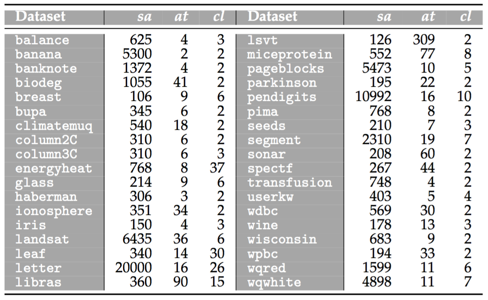

 

This webpage contains complementary material to the research paper:

| | |
|:---|:---|
||José A. Sáez and José L. Romero-Béjar. **On the suitability of bagging-based ensembles with borderline label noise**. [Mathematics](https://www.mdpi.com/journal/mathematics) 10 (2022) 1892.|
| | |

 

The web is organized according to the following summary:

1. [Real-world datasets](#Datasets)
2. [Performance and robustness results](#Performance)

 
 
##  1. Real-world datasets

The experiment in this research is based on the following real-world datasets, which are injected with different levels of borderline label noise:

These datasets can be downloaded from the webpages:
- [UCI Machine Learning Repository](https://archive.ics.uci.edu/ml/index.php)
- [KEEL-dataset Repository](http://www.keel.es)

Additionally, these datasets can be downloaded [here](https://github.com/joseasaezm/bagbln/raw/main/docs/data.zip).

 

##  2. Performance and robustness results

|||
|:---|:---:|
|**Neighborwise borderline label noise** |**File**|
|&nbsp;&nbsp;&nbsp;**-** *Accuracy results per noise level* | |
|&nbsp;&nbsp;&nbsp;**-** *Robustness results per noise level* | |
|&nbsp;&nbsp;&nbsp;**-** *Box-plots of robustness results* | |
|**Non-linearwise borderline label noise** |**File**|
|&nbsp;&nbsp;&nbsp;**-** *Accuracy results per noise level* | |
|&nbsp;&nbsp;&nbsp;**-** *Robustness results per noise level* | |
|&nbsp;&nbsp;&nbsp;**-** *Box-plots of robustness results* | |
|||
